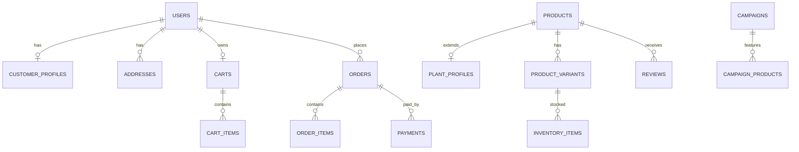

# Nursery Platform — Project Development Guide

Master guide for building the **Plant Nursery & Gardening E-Commerce Platform**.

Use this document to implement the system (human developers, team, or AI agent).  
Change any endpoint field, path, or status code here first — then update code to match.

| Item | Value |
|------|--------|
| Backend | PHP Laravel 11+ REST API |
| Database | MySQL 8 |
| Architecture | Modular monolith |
| Base URL | `https://api.example.com/api/v1` |
| Clients | Website, Android, iOS, future partners |
| Hosting (phase 1) | Hostinger shared hosting (PHP + MySQL + cron) |
| Document status | Design / implementation contract |
| Build & ship steps | See **`IMPLEMENTATION_PLAYBOOK.md`** |

---

## Table of Contents

1. [Goals & Architecture](#1-goals--architecture)
2. [Technology Stack](#2-technology-stack)
3. [Project Folder Structure](#3-project-folder-structure)
4. [JSON Contract Standard](#4-json-contract-standard)
5. [Common Headers & Auth Rules](#5-common-headers--auth-rules) (includes persistent login)
6. [Roles & Permissions](#6-roles--permissions)
7. [Database Design](#7-database-design)
8. [Product / Plant Domain Model](#8-product--plant-domain-model)
9. [API Endpoint Catalog](#9-api-endpoint-catalog) ← **exact request/response for every endpoint**
10. [Order · Payment · Inventory Rules](#10-order--payment--inventory-rules)
11. [Campaigns · Search · Recommendations · Notifications](#11-campaigns--search--recommendations--notifications)
12. [Integrations](#12-integrations)
13. [Admin Scope](#13-admin-scope)
14. [Web & Mobile Client Notes](#14-web--mobile-client-notes)
15. [Hostinger Deployment](#15-hostinger-deployment)
16. [Security Checklist](#16-security-checklist)
17. [Testing Checklist](#17-testing-checklist)
18. [Development Roadmap](#18-development-roadmap)
19. [Final Decisions](#19-final-decisions)

---

## 1. Goals & Architecture

### 1.1 What we are building

One nursery e-commerce backend that powers:

- Customer website
- Android app
- iOS app
- Future partner / supplier / delivery / payment systems

All clients talk to **one PHP REST API** with JSON. No client accesses the database directly.

```
Website / Android / iOS / Partners
              │
         HTTPS + JSON
              │
              ▼
     Laravel Modular Monolith
         /api/v1/*
              │
              ▼
           MySQL 8
```

### 1.2 Architecture decision

| Choice | Decision |
|--------|----------|
| Style | **Modular monolith** (not microservices) |
| Why | Fits Hostinger shared hosting, simpler deploy, faster delivery |
| Future | Keep module boundaries clean so Catalog / Order / Payment / Notification can be extracted later |

```
Phase 1: Modular monolith on Hostinger
Phase 2: VPS + Redis + real queue workers + CDN
Phase 3: Extract hot modules only if needed
```

### 1.3 Customer journey (must work end-to-end)

```
Home → Campaign → Category → Filter → Plant detail (+ care info)
  → Add to cart → Recommendations → Cart → Coupon → Address
  → Delivery → Payment → Order confirm → Tracking → Review
```

---

## 2. Technology Stack

| Layer | Choice |
|-------|--------|
| API | Laravel 11+, PHP 8.2+ |
| DB | MySQL 8 |
| Auth | JWT access token + rotating refresh token |
| Queue (phase 1) | Database queue + Hostinger cron |
| Cache (phase 1) | File / APCu |
| Web | Next.js (TypeScript) |
| Mobile | Flutter (Android + iOS) |
| Admin | Laravel API + admin UI (`/admin` or `admin.example.com`) |
| Payments | Adapter pattern (start with one provider, e.g. Razorpay) |
| Push | FCM + APNs (via Firebase) |
| Docs | OpenAPI + Postman collection generated from this contract |

---

## 3. Project Folder Structure

```
nursery-api/
├── app/
│   ├── Modules/
│   │   ├── Auth/
│   │   ├── Customer/
│   │   ├── Catalog/
│   │   ├── Plant/
│   │   ├── Inventory/
│   │   ├── Cart/
│   │   ├── Wishlist/
│   │   ├── Order/
│   │   ├── Payment/
│   │   ├── Promotion/
│   │   ├── Campaign/
│   │   ├── Review/
│   │   ├── Notification/
│   │   ├── Delivery/
│   │   ├── Supplier/
│   │   ├── Support/
│   │   └── Report/
│   ├── Shared/
│   │   ├── Http/Middleware/
│   │   ├── Exceptions/
│   │   ├── Support/ApiResponse.php
│   │   ├── Enums/
│   │   ├── Events/
│   │   └── Jobs/
│   └── Integrations/
│       ├── Payment/
│       ├── Sms/
│       ├── Email/
│       ├── Push/
│       └── Shipping/
├── database/migrations/
├── database/seeders/
├── public/                 ← Hostinger document root
├── routes/api.php
├── storage/
├── tests/
├── openapi.yaml
├── .env.example
└── composer.json
```

**Per-module layout**

```
ModuleName/
├── Http/Controllers/
├── Http/Requests/
├── Http/Resources/
├── Services/
├── Models/
├── Routes/api.php
└── Providers/
```

Flow: `Controller → FormRequest → Service → Model → Resource → ApiResponse`

---

## 4. JSON Contract Standard

Every endpoint must return this envelope. Do not invent alternate shapes.

### 4.1 Success

```json
{
  "success": true,
  "message": "Human-readable success message",
  "data": {},
  "errors": null,
  "meta": {
    "request_id": "req_01HXYZ",
    "timestamp": "2026-08-10T01:00:00+05:30"
  }
}
```

- `data` may be an object, array, or `null`
- List endpoints put rows in `data` and pagination in `meta.pagination`

### 4.2 Validation error — HTTP 422

```json
{
  "success": false,
  "message": "Validation failed",
  "data": null,
  "errors": {
    "email": ["The email field is required."],
    "password": ["The password must be at least 8 characters."]
  },
  "meta": {
    "error_code": "VALIDATION_ERROR",
    "request_id": "req_01HXYZ",
    "timestamp": "2026-08-10T01:00:00+05:30"
  }
}
```

### 4.3 Other errors

```json
{
  "success": false,
  "message": "Short explanation for client UI",
  "data": null,
  "errors": null,
  "meta": {
    "error_code": "NOT_FOUND",
    "request_id": "req_01HXYZ",
    "timestamp": "2026-08-10T01:00:00+05:30"
  }
}
```

Optional: put safe context in `data` (e.g. `{ "available_qty": 3 }`).

### 4.4 Error codes

| HTTP | `meta.error_code` | Use when |
|------|-------------------|----------|
| 400 | `BAD_REQUEST` | Malformed JSON / bad params |
| 401 | `UNAUTHENTICATED` | Missing or invalid token |
| 403 | `FORBIDDEN` | Authenticated but not allowed |
| 404 | `NOT_FOUND` | Resource missing |
| 409 | `CONFLICT` | Duplicate / illegal state |
| 409 | `INVENTORY_INSUFFICIENT` | Not enough stock |
| 400 | `PAYMENT_FAILED` | Payment declined / failed |
| 422 | `VALIDATION_ERROR` | Field validation |
| 429 | `RATE_LIMITED` | Too many requests |
| 502 | `EXTERNAL_API_ERROR` | Payment/SMS/shipping provider error |
| 500 | `SERVER_ERROR` | Unexpected server fault |

### 4.5 Pagination `meta`

```json
"meta": {
  "request_id": "req_01HXYZ",
  "timestamp": "2026-08-10T01:00:00+05:30",
  "pagination": {
    "current_page": 1,
    "per_page": 20,
    "total": 240,
    "last_page": 12
  }
}
```

Default: `page=1`, `per_page=20` (max 50).

---

## 5. Common Headers & Auth Rules

### 5.1 Headers

| Header | Required | Notes |
|--------|----------|--------|
| `Accept: application/json` | Yes | Always |
| `Content-Type: application/json` | Yes for body | POST/PUT/PATCH |
| `Authorization: Bearer <access_token>` | Private routes | JWT |
| `X-Platform` | Recommended | `web` \| `android` \| `ios` |
| `X-App-Version` | Mobile | e.g. `1.0.3` |
| `X-Request-Id` | Optional | Client correlation id |
| `Accept-Language` | Optional | `en`, `hi`, … |
| `X-Cart-Token` | Guest cart | Opaque cart token for guests |

### 5.2 Auth types used in this catalog

| Label | Meaning |
|-------|---------|
| **Public** | No token |
| **Customer** | Valid customer JWT |
| **Admin** | Valid JWT with required admin permission |
| **Webhook** | Provider signature (no customer JWT) |

### 5.3 Persistent login (stay signed in — required)

Customer session must work like normal e-commerce apps/websites:

- Login **once** → stay logged in
- Closing the app, swiping it away, phone restart, or killing the process must **not** log the customer out
- Browser tab close / browser restart must **not** log the customer out (web)
- Session ends only when the customer taps **Logout**, or when the server revokes the session (password reset, admin block, refresh token expired/stolen)

**Token lifetimes (plain English)**

Think of two keys after login:

| Key | What it is | How long it lasts | What it does |
|-----|------------|-------------------|--------------|
| **Access token** | Day-pass for API calls | **60 minutes** | Sent on every request (`Authorization: Bearer ...`). Proves “this request is from a logged-in user.” |
| **Refresh token** | Long stay-signed-in key | **90 days**, and resets when used (**sliding**) | Stored on the phone/browser. Used only to get a **new** access token when the old one expires. Customer never types password again. |

**Why two tokens?**

- Access token is short (60 min) so if it leaks, damage is limited.
- Refresh token is long so closing the app does **not** force login again.
- App flow: access expired → app quietly calls AUTH-03 with refresh token → gets new access token → user stays logged in (no login screen).

**What “sliding” means**

- Refresh token is valid for 90 days from issue.
- Each time the app successfully refreshes, server gives a **new** refresh token valid for another 90 days.
- Example: user opens app every few weeks → always stays logged in.
- Example: user never opens app for 90+ days → must login again.
- Manual **Logout** deletes/revokes the refresh token → must login again.

So for normal daily/weekly use: **login once → stay logged in until Logout**.

**Client rules (Android / iOS / Web) — must implement**

1. After AUTH-01 / AUTH-02, save both tokens + basic user profile in **persistent secure storage**:
   - Mobile: Keychain (iOS) / Keystore EncryptedSharedPreferences (Android) via `flutter_secure_storage` (or equivalent)
   - Web: `HttpOnly` + `Secure` + `SameSite` cookie for refresh token preferred; or secure persistent storage for SPA + silent refresh
2. **Never** clear tokens on app background, terminate, force-stop, or cold start
3. On app / site open:
   - If access token still valid → treat as logged in; restore cart/wishlist/profile from API
   - If access token expired but refresh token exists → call AUTH-03 silently → save new tokens → continue as logged in
   - If refresh fails with `401` → clear local session → show login
4. On any API `401`:
   - Try AUTH-03 once
   - Retry the original request with the new access token
   - Only if refresh fails → logout locally and send user to login
5. AUTH-04 Logout is the **only** normal customer action that deletes local tokens and revokes refresh token on the server
6. Guest cart (`X-Cart-Token`) merges into the customer cart after login and stays tied to that account on later opens

**Server rules**

1. Store refresh tokens **hashed** in `refresh_tokens` with `user_id`, `device_id`, `expires_at`, `revoked_at`
2. Rotate refresh token on every AUTH-03 (invalidate old, return new)
3. AUTH-04 sets `revoked_at` (and optionally revokes all devices if `all_devices: true`)
4. Password reset / change password → revoke all refresh tokens for that user
5. Do not require login again only because the access token expired

**Local data that must remain after reopen (same account)**

| Data | How |
|------|-----|
| Logged-in identity | Restored from stored tokens + `GET /auth/me` |
| Cart | Server-side customer cart (not cleared on app kill) |
| Wishlist | Server-side |
| Addresses / orders / profile | Server-side |
| Optional UI cache | Local cache OK; revalidate from API on open |

---

## 6. Roles & Permissions

### 6.1 Roles

`customer`, `super_admin`, `admin`, `nursery_manager`, `inventory_manager`, `sales_manager`, `order_manager`, `delivery_manager`, `customer_support`, `content_manager`, `supplier`, `accountant`

### 6.2 Permission format

`resource.action` examples:

- `products.read`, `products.write`, `products.publish`
- `inventory.view`, `inventory.adjust`
- `orders.view`, `orders.update_status`, `orders.cancel`
- `payments.refund`
- `campaigns.manage`
- `users.manage`
- `reports.view`

Admin endpoints check permission in middleware/policy. Re-check from DB for sensitive mutations (do not trust JWT claims alone).

---

## 7. Database Design

Full table/column specs, DB switching, request-response logs, and future mapping live in **`DATABASE_DESIGN.md`**. This section is the short summary.

### 7.1 Core tables (implement these)

**Identity:** `users`, `roles`, `permissions`, `role_permission`, `user_role`, `customer_profiles`, `addresses`, `user_devices`, `refresh_tokens`, `audit_logs`

**Catalog:** `categories`, `brands`, `products`, `product_variants`, `product_images`, `product_videos`, `product_categories`, `tags`, `product_tags`, `product_relations`, `plant_profiles`, `fertilizer_profiles`, `pot_profiles`, `tool_profiles`, `soil_profiles`, `care_product_profiles`, `accessory_profiles`

**Inventory:** `warehouses`, `inventory_items`, `stock_movements`, `suppliers`, `purchase_orders`, `purchase_order_items`

**Commerce:** `carts`, `cart_items`, `wishlists`, `coupons`, `coupon_redemptions`, `promotions`, `campaigns`, `campaign_products`, `banners`, `orders`, `order_items`, `order_status_histories`, `payments`, `refunds`, `return_requests`, `return_items`, `shipments`, `shipment_events`

**Engagement:** `reviews`, `review_images`, `notifications`, `notification_templates`, `recommendation_rules`, `support_tickets`, `support_messages`

**Config:** `settings`, `tax_rates`, `shipping_methods`, `shipping_zones`

### 7.2 Key relationships

```
users 1—1 customer_profiles
users 1—* addresses
users *—* roles *—* permissions
categories 1—* categories (parent)
products *—* categories
products 1—0..1 plant_profiles (or other profile by product_type)
products 1—* product_variants
products 1—* product_images
variant 1—* inventory_items *—1 warehouses
users 1—1 carts 1—* cart_items
users 1—* orders 1—* order_items
orders 1—* payments
orders 1—* shipments
products 1—* reviews *—1 users
```

### 7.3 Money & stock rules

- Money: `DECIMAL(12,2)`, currency `INR` (configurable)
- Soft deletes: `deleted_at` on customer-owned and catalog entities where needed
- Inventory: `qty_on_hand`, `qty_reserved`, `qty_damaged`, `low_stock_threshold`
- Sellable = `qty_on_hand - qty_reserved - qty_damaged`
- Checkout uses `SELECT … FOR UPDATE` inside a DB transaction

### 7.4 Important unique / indexes

| Table | Index |
|-------|--------|
| `products` | unique `sku`, unique `slug`; index `(status, product_type)`; FULLTEXT `(name, description)` |
| `plant_profiles` | indexes on `indoor_outdoor`, `sunlight`, `difficulty_level` |
| `inventory_items` | unique `(warehouse_id, product_variant_id)` |
| `cart_items` | unique `(cart_id, product_variant_id)` |
| `wishlists` | unique `(user_id, product_id)` |
| `orders` | unique `order_number`; index `(user_id, created_at)`, `(status)` |
| `payments` | unique `idempotency_key`; index `provider_payment_id` |
| `reviews` | unique `(product_id, user_id)` |

### 7.5 ER overview



---

## 8. Product / Plant Domain Model

### 8.1 Product types

`plant`, `tree`, `seed`, `fertilizer`, `pesticide`, `soil`, `pot`, `tool`, `accessory`, `bundle`

Commercial fields live on `products`. Type-specific fields live on extension tables (e.g. `plant_profiles`).

### 8.2 Plant profile fields

`common_name`, `scientific_name`, `local_names` (JSON), `plant_kind`, `indoor_outdoor`, `sunlight`, `water_requirement`, `soil_type`, `temperature_min_c`, `temperature_max_c`, `humidity_requirement`, `growth_rate`, `mature_height_cm`, `mature_width_cm`, `flowering_season`, `fruiting_season`, `planting_season`, `bloom_color`, `flowering_duration`, `lifespan`, `difficulty_level`, `care_level`, `propagation_method`, `toxicity_info`, `pet_safety`, `benefits`, `uses`, `growing_instructions`, `planting_instructions`, `pruning_instructions`, `fertilization_instructions`, `pest_disease_info`, `harvest_info`

### 8.3 Other profiles (minimum)

| Type | Fields |
|------|--------|
| Fertilizer | `npk_ratio`, `suitable_plant_types`, `application_frequency`, `application_quantity`, `usage_instructions`, `organic` |
| Pot | `material`, `diameter_cm`, `height_cm`, `capacity_liters`, `drainage_holes`, `indoor_outdoor_suitability` |
| Tool | `material`, `size`, `usage`, `brand_id`, `warranty_months` |

### 8.4 Shared product card object

Used in lists (home, search, cart, wishlist, related):

```json
{
  "id": 101,
  "sku": "PLT-MONEY-001",
  "name": "Money Plant",
  "slug": "money-plant",
  "product_type": "plant",
  "price": 299.00,
  "compare_at_price": 349.00,
  "currency": "INR",
  "stock_status": "in_stock",
  "thumbnail_url": "https://cdn.example.com/plants/money-thumb.webp",
  "rating_avg": 4.6,
  "rating_count": 128,
  "badges": ["bestseller", "low_maintenance"]
}
```

---

## 9. API Endpoint Catalog

**How to read each endpoint**

```
### CODE — Title
METHOD path
Auth: Public | Customer | Admin | Webhook
Permission: (admin only)
```

Then: Query / Headers / Request body / Success response / Common errors.

To change an API later: edit the block below, then update controller + clients.

---

### 9.1 Auth

#### AUTH-01 — Register

```
POST /api/v1/auth/register
Auth: Public
```

**Request**

```json
{
  "name": "Asha Kumar",
  "email": "asha@example.com",
  "phone": "9876543210",
  "password": "Secret@123",
  "password_confirmation": "Secret@123"
}
```

**Success — 201**

```json
{
  "success": true,
  "message": "Registration successful",
  "data": {
    "token_type": "Bearer",
    "access_token": "eyJhbGciOiJIUzI1NiIsInR5cCI6IkpXVCJ9...",
    "refresh_token": "def50200a1b2c3...",
    "expires_in": 3600,
    "user": {
      "id": 42,
      "name": "Asha Kumar",
      "email": "asha@example.com",
      "phone": "9876543210",
      "roles": ["customer"]
    }
  },
  "errors": null,
  "meta": {
    "request_id": "req_01HXYZ",
    "timestamp": "2026-08-10T01:00:00+05:30"
  }
}
```

**Errors:** `422 VALIDATION_ERROR`, `409 CONFLICT` (email/phone exists)

---

#### AUTH-02 — Login

```
POST /api/v1/auth/login
Auth: Public
```

**Request**

```json
{
  "email": "asha@example.com",
  "password": "Secret@123",
  "device": {
    "platform": "android",
    "device_id": "device-uuid-optional",
    "push_token": "fcm_token_optional"
  }
}
```

**Success — 200** — same shape as AUTH-01 `data` (tokens + user).

**Client must:** persist `access_token`, `refresh_token`, and user basics in secure storage immediately. Closing the app must not clear them (§5.3).

**Errors:** `401 UNAUTHENTICATED`, `422 VALIDATION_ERROR`, `429 RATE_LIMITED`

---

#### AUTH-03 — Refresh token

```
POST /api/v1/auth/refresh
Auth: Public (refresh token in body)
```

Used for **silent re-login** when the access token expires (app reopen, long background, midnight, etc.). Customer should not see a login screen if refresh succeeds.

**Request**

```json
{
  "refresh_token": "def50200a1b2c3..."
}
```

**Success — 200**

```json
{
  "success": true,
  "message": "Token refreshed",
  "data": {
    "token_type": "Bearer",
    "access_token": "eyJhbGciOiJIUzI1NiIsInR5cCI6IkpXVCJ9...",
    "refresh_token": "new_refresh_token...",
    "expires_in": 3600
  },
  "errors": null,
  "meta": { "request_id": "req_01HXYZ", "timestamp": "2026-08-10T01:00:00+05:30" }
}
```

**Client must:** overwrite both tokens in secure storage. Old refresh token becomes invalid (rotation).

**Errors:** `401 UNAUTHENTICATED` (missing, expired, or revoked refresh → clear local session and show login)

---

#### AUTH-04 — Logout

```
POST /api/v1/auth/logout
Auth: Customer
```

This is the **only** normal way a customer ends the persistent session.

**Request**

```json
{
  "refresh_token": "def50200a1b2c3...",
  "all_devices": false
}
```

| Field | Required | Notes |
|-------|----------|--------|
| `refresh_token` | Yes | Current device session to revoke |
| `all_devices` | No | `true` = logout everywhere (revoke all refresh tokens for user) |

**Success — 200**

```json
{
  "success": true,
  "message": "Logged out successfully",
  "data": null,
  "errors": null,
  "meta": { "request_id": "req_01HXYZ", "timestamp": "2026-08-10T01:00:00+05:30" }
}
```

**Client must after success (or even if network fails after user confirms logout):** delete access token, refresh token, and cached account data from device/browser storage. Next open shows logged-out / guest state.

---

#### AUTH-05 — Forgot password

```
POST /api/v1/auth/forgot-password
Auth: Public
```

**Request**

```json
{
  "email": "asha@example.com"
}
```

**Success — 200** (always generic message; do not reveal if email exists)

```json
{
  "success": true,
  "message": "If the email exists, a reset link has been sent",
  "data": null,
  "errors": null,
  "meta": { "request_id": "req_01HXYZ", "timestamp": "2026-08-10T01:00:00+05:30" }
}
```

---

#### AUTH-06 — Reset password

```
POST /api/v1/auth/reset-password
Auth: Public
```

**Request**

```json
{
  "email": "asha@example.com",
  "token": "reset-token-from-email",
  "password": "NewSecret@123",
  "password_confirmation": "NewSecret@123"
}
```

**Success — 200**

```json
{
  "success": true,
  "message": "Password reset successful",
  "data": null,
  "errors": null,
  "meta": { "request_id": "req_01HXYZ", "timestamp": "2026-08-10T01:00:00+05:30" }
}
```

**Errors:** `400 BAD_REQUEST` (invalid/expired token), `422 VALIDATION_ERROR`

---

#### AUTH-07 — Current user

```
GET /api/v1/auth/me
Auth: Customer
```

**Success — 200**

```json
{
  "success": true,
  "message": "Profile retrieved successfully",
  "data": {
    "id": 42,
    "name": "Asha Kumar",
    "email": "asha@example.com",
    "phone": "9876543210",
    "roles": ["customer"],
    "permissions": []
  },
  "errors": null,
  "meta": { "request_id": "req_01HXYZ", "timestamp": "2026-08-10T01:00:00+05:30" }
}
```

---

### 9.2 Customer profile & addresses

#### CUST-01 — Update profile

```
PUT /api/v1/customer/profile
Auth: Customer
```

**Request**

```json
{
  "name": "Asha Kumar",
  "phone": "9876543210"
}
```

**Success — 200**

```json
{
  "success": true,
  "message": "Profile updated successfully",
  "data": {
    "id": 42,
    "name": "Asha Kumar",
    "email": "asha@example.com",
    "phone": "9876543210"
  },
  "errors": null,
  "meta": { "request_id": "req_01HXYZ", "timestamp": "2026-08-10T01:00:00+05:30" }
}
```

---

#### CUST-02 — List addresses

```
GET /api/v1/customer/addresses
Auth: Customer
```

**Success — 200**

```json
{
  "success": true,
  "message": "Addresses retrieved successfully",
  "data": [
    {
      "id": 11,
      "label": "Home",
      "name": "Asha Kumar",
      "phone": "9876543210",
      "line1": "12 Green Street",
      "line2": "Near City Park",
      "city": "Pune",
      "state": "Maharashtra",
      "postal_code": "411001",
      "country": "IN",
      "is_default": true
    }
  ],
  "errors": null,
  "meta": { "request_id": "req_01HXYZ", "timestamp": "2026-08-10T01:00:00+05:30" }
}
```

---

#### CUST-03 — Create address

```
POST /api/v1/customer/addresses
Auth: Customer
```

**Request**

```json
{
  "label": "Home",
  "name": "Asha Kumar",
  "phone": "9876543210",
  "line1": "12 Green Street",
  "line2": "Near City Park",
  "city": "Pune",
  "state": "Maharashtra",
  "postal_code": "411001",
  "country": "IN",
  "is_default": true
}
```

**Success — 201** — `data` = created address object (same fields + `id`).

---

#### CUST-04 — Update address

```
PUT /api/v1/customer/addresses/{id}
Auth: Customer
```

**Request** — same fields as CUST-03 (partial update allowed).

**Success — 200** — updated address.  
**Errors:** `404 NOT_FOUND`, `403 FORBIDDEN`

---

#### CUST-05 — Delete address

```
DELETE /api/v1/customer/addresses/{id}
Auth: Customer
```

**Success — 200**

```json
{
  "success": true,
  "message": "Address deleted successfully",
  "data": null,
  "errors": null,
  "meta": { "request_id": "req_01HXYZ", "timestamp": "2026-08-10T01:00:00+05:30" }
}
```

---

### 9.3 Home, banners, campaigns

#### HOME-01 — Home feed

```
GET /api/v1/home
Auth: Public (personalized rails if Customer token sent)
```

**Success — 200**

```json
{
  "success": true,
  "message": "Home retrieved successfully",
  "data": {
    "banners": [
      {
        "id": 1,
        "title": "Monsoon Special",
        "image_url": "https://cdn.example.com/banners/monsoon.webp",
        "link_type": "campaign",
        "link_value": "monsoon-plants-2026",
        "sort_order": 1
      }
    ],
    "campaigns": [
      {
        "id": 5,
        "slug": "monsoon-plants-2026",
        "title": "Monsoon Plants",
        "subtitle": "Best plants for rainy season",
        "image_url": "https://cdn.example.com/campaigns/monsoon.webp"
      }
    ],
    "featured_products": [],
    "new_arrivals": [],
    "best_sellers": [],
    "recommended_for_you": []
  },
  "errors": null,
  "meta": { "request_id": "req_01HXYZ", "timestamp": "2026-08-10T01:00:00+05:30" }
}
```

Product arrays use the **shared product card** object from §8.4.

---

#### BAN-01 — List banners

```
GET /api/v1/banners?placement=home
Auth: Public
```

**Success — 200** — `data` = array of banner objects (see HOME-01).

---

#### CAMP-01 — List campaigns

```
GET /api/v1/campaigns?status=active&season=monsoon
Auth: Public
```

**Success — 200** — `data` = campaign summary array + pagination meta.

---

#### CAMP-02 — Campaign detail

```
GET /api/v1/campaigns/{slug}
Auth: Public
```

**Success — 200**

```json
{
  "success": true,
  "message": "Campaign retrieved successfully",
  "data": {
    "id": 5,
    "slug": "monsoon-plants-2026",
    "title": "Monsoon Plants",
    "subtitle": "Best plants for rainy season",
    "description": "Shop plants that thrive in monsoon...",
    "season_code": "monsoon",
    "starts_at": "2026-06-01T00:00:00+05:30",
    "ends_at": "2026-09-30T23:59:59+05:30",
    "image_url": "https://cdn.example.com/campaigns/monsoon.webp",
    "products": []
  },
  "errors": null,
  "meta": {
    "request_id": "req_01HXYZ",
    "timestamp": "2026-08-10T01:00:00+05:30",
    "pagination": {
      "current_page": 1,
      "per_page": 20,
      "total": 48,
      "last_page": 3
    }
  }
}
```

**Errors:** `404 NOT_FOUND`

---

### 9.4 Categories & brands

#### CAT-01 — List categories

```
GET /api/v1/categories?parent_id=&flat=false
Auth: Public
```

**Success — 200**

```json
{
  "success": true,
  "message": "Categories retrieved successfully",
  "data": [
    {
      "id": 1,
      "name": "Indoor Plants",
      "slug": "indoor-plants",
      "image_url": "https://cdn.example.com/categories/indoor.webp",
      "parent_id": null,
      "children": [
        {
          "id": 11,
          "name": "Low Maintenance",
          "slug": "low-maintenance",
          "image_url": null,
          "parent_id": 1,
          "children": []
        }
      ]
    }
  ],
  "errors": null,
  "meta": { "request_id": "req_01HXYZ", "timestamp": "2026-08-10T01:00:00+05:30" }
}
```

---

#### CAT-02 — Category by slug

```
GET /api/v1/categories/{slug}
Auth: Public
```

**Success — 200** — single category object (+ optional `children`).  
**Errors:** `404 NOT_FOUND`

---

#### BRAND-01 — List brands

```
GET /api/v1/brands
Auth: Public
```

**Success — 200**

```json
{
  "success": true,
  "message": "Brands retrieved successfully",
  "data": [
    { "id": 3, "name": "GreenLeaf", "slug": "greenleaf", "logo_url": "https://cdn.example.com/brands/greenleaf.webp" }
  ],
  "errors": null,
  "meta": { "request_id": "req_01HXYZ", "timestamp": "2026-08-10T01:00:00+05:30" }
}
```

---

### 9.5 Products, plants, search

#### PROD-01 — List / filter products

```
GET /api/v1/products
Auth: Public
```

**Query params**

| Param | Example | Notes |
|-------|---------|--------|
| `q` | `indoor plants` | Search text |
| `category` | `indoor-plants` | Slug |
| `product_type` | `plant` | |
| `brand` | `greenleaf` | Slug |
| `min_price` / `max_price` | `100` / `500` | |
| `indoor_outdoor` | `indoor` | Plant filter |
| `sunlight` | `bright_indirect` | |
| `water_requirement` | `low` | |
| `difficulty_level` | `easy` | |
| `season` | `monsoon` | |
| `availability` | `in_stock` | |
| `min_rating` | `4` | |
| `sort` | `price_asc` | `price_asc\|price_desc\|newest\|popular\|rating` |
| `page` / `per_page` | `1` / `20` | |

**Success — 200**

```json
{
  "success": true,
  "message": "Products retrieved successfully",
  "data": [
    {
      "id": 101,
      "sku": "PLT-MONEY-001",
      "name": "Money Plant",
      "slug": "money-plant",
      "product_type": "plant",
      "price": 299.00,
      "compare_at_price": 349.00,
      "currency": "INR",
      "stock_status": "in_stock",
      "thumbnail_url": "https://cdn.example.com/plants/money-thumb.webp",
      "rating_avg": 4.6,
      "rating_count": 128,
      "badges": ["bestseller"]
    }
  ],
  "errors": null,
  "meta": {
    "request_id": "req_01HXYZ",
    "timestamp": "2026-08-10T01:00:00+05:30",
    "pagination": {
      "current_page": 1,
      "per_page": 20,
      "total": 240,
      "last_page": 12
    },
    "filters_applied": {
      "indoor_outdoor": "indoor",
      "difficulty_level": "easy"
    }
  }
}
```

---

#### PROD-02 — Product detail (by id or slug)

```
GET /api/v1/products/{idOrSlug}
Auth: Public
```

**Success — 200**

```json
{
  "success": true,
  "message": "Product retrieved successfully",
  "data": {
    "id": 101,
    "sku": "PLT-MONEY-001",
    "name": "Money Plant",
    "slug": "money-plant",
    "product_type": "plant",
    "description": "Popular indoor trailing plant...",
    "price": 299.00,
    "compare_at_price": 349.00,
    "currency": "INR",
    "stock_status": "in_stock",
    "available_qty": 42,
    "rating_avg": 4.6,
    "rating_count": 128,
    "brand": { "id": 3, "name": "GreenLeaf", "slug": "greenleaf" },
    "categories": [
      { "id": 1, "name": "Indoor Plants", "slug": "indoor-plants" }
    ],
    "tags": ["beginner", "air-purifying"],
    "images": [
      {
        "id": 901,
        "url": "https://cdn.example.com/plants/money-1.webp",
        "alt": "Money Plant",
        "is_primary": true,
        "sort_order": 1
      }
    ],
    "videos": [],
    "variants": [],
    "plant": {
      "common_name": "Money Plant",
      "scientific_name": "Epipremnum aureum",
      "local_names": { "hi": "मनी प्लांट" },
      "indoor_outdoor": "indoor",
      "sunlight": "bright_indirect",
      "sunlight_label": "Bright indirect light",
      "water_requirement": "medium",
      "water_label": "2–3 times per week",
      "soil_type": "well_draining",
      "temperature_min_c": 18,
      "temperature_max_c": 30,
      "humidity_requirement": "medium",
      "growth_rate": "fast",
      "mature_height_cm": 200,
      "mature_width_cm": 60,
      "planting_season": ["year_round"],
      "flowering_season": [],
      "fruiting_season": [],
      "bloom_color": null,
      "difficulty_level": "easy",
      "care_level": "low",
      "propagation_method": "cutting",
      "toxicity_info": "Mildly toxic if ingested",
      "pet_safety": "toxic",
      "benefits": ["Air purifying", "Easy propagation"],
      "uses": ["ornamental"],
      "growing_instructions": "Place in bright indirect light...",
      "planting_instructions": "Use well-draining potting mix...",
      "pruning_instructions": "Trim long vines to encourage bushiness...",
      "fertilization_instructions": "Feed monthly in growing season...",
      "pest_disease_info": "Watch for mealybugs...",
      "harvest_info": null
    },
    "related": [],
    "frequently_bought_together": []
  },
  "errors": null,
  "meta": { "request_id": "req_01HXYZ", "timestamp": "2026-08-10T01:00:00+05:30" }
}
```

Notes:
- For non-plant types, replace `plant` with `fertilizer` / `pot` / `tool` / etc.
- `related` and `frequently_bought_together` use product cards.

**Errors:** `404 NOT_FOUND`

---

#### PROD-03 — Related products

```
GET /api/v1/products/{id}/related
Auth: Public
```

**Success — 200** — `data` = array of product cards.

---

#### PROD-04 — Recommendations

```
GET /api/v1/products/{id}/recommendations?type=similar
Auth: Public (personalized if Customer)
```

`type`: `similar` | `fbt` | `personalized` | `beginner` | `low_sunlight` | `seasonal`

**Success — 200** — `data` = array of product cards + `meta.recommendation_type`.

---

#### PLANT-01 — List plants (facade)

```
GET /api/v1/plants
Auth: Public
```

Same query params as PROD-01, forced `product_type` in plant family (`plant|tree|seed`).  
**Success — 200** — same list shape as PROD-01.

---

#### PLANT-02 — Plant detail

```
GET /api/v1/plants/{idOrSlug}
Auth: Public
```

Same response as PROD-02 (must include `plant` object).  
**Errors:** `404 NOT_FOUND`

---

#### PLANT-03 — Plant care only

```
GET /api/v1/plants/{idOrSlug}/care
Auth: Public
```

**Success — 200**

```json
{
  "success": true,
  "message": "Plant care retrieved successfully",
  "data": {
    "product_id": 101,
    "name": "Money Plant",
    "sunlight_label": "Bright indirect light",
    "water_label": "2–3 times per week",
    "soil_type": "well_draining",
    "temperature_min_c": 18,
    "temperature_max_c": 30,
    "difficulty_level": "easy",
    "care_level": "low",
    "growing_instructions": "Place in bright indirect light...",
    "planting_instructions": "Use well-draining potting mix...",
    "pruning_instructions": "Trim long vines...",
    "fertilization_instructions": "Feed monthly...",
    "pest_disease_info": "Watch for mealybugs...",
    "pet_safety": "toxic",
    "toxicity_info": "Mildly toxic if ingested"
  },
  "errors": null,
  "meta": { "request_id": "req_01HXYZ", "timestamp": "2026-08-10T01:00:00+05:30" }
}
```

---

#### SEARCH-01 — Search

```
GET /api/v1/search?q=rose&page=1&per_page=20
Auth: Public
```

Supports same filters as PROD-01.  
**Success — 200** — same list shape as PROD-01; include `meta.query = "rose"`.

---

### 9.6 Wishlist

#### WISH-01 — List wishlist

```
GET /api/v1/wishlist
Auth: Customer
```

**Success — 200** — `data` = array of product cards (or objects with `wishlist_item_id` + `product`).

```json
{
  "success": true,
  "message": "Wishlist retrieved successfully",
  "data": [
    {
      "wishlist_item_id": 77,
      "added_at": "2026-08-01T10:00:00+05:30",
      "product": {
        "id": 101,
        "sku": "PLT-MONEY-001",
        "name": "Money Plant",
        "slug": "money-plant",
        "product_type": "plant",
        "price": 299.00,
        "compare_at_price": 349.00,
        "currency": "INR",
        "stock_status": "in_stock",
        "thumbnail_url": "https://cdn.example.com/plants/money-thumb.webp",
        "rating_avg": 4.6,
        "rating_count": 128,
        "badges": []
      }
    }
  ],
  "errors": null,
  "meta": { "request_id": "req_01HXYZ", "timestamp": "2026-08-10T01:00:00+05:30" }
}
```

---

#### WISH-02 — Add to wishlist

```
POST /api/v1/wishlist
Auth: Customer
```

**Request**

```json
{
  "product_id": 101
}
```

**Success — 201**

```json
{
  "success": true,
  "message": "Added to wishlist",
  "data": {
    "wishlist_item_id": 77,
    "product_id": 101
  },
  "errors": null,
  "meta": { "request_id": "req_01HXYZ", "timestamp": "2026-08-10T01:00:00+05:30" }
}
```

**Errors:** `404 NOT_FOUND`, `409 CONFLICT` (already exists), `422 VALIDATION_ERROR`

---

#### WISH-03 — Remove from wishlist

```
DELETE /api/v1/wishlist/{productId}
Auth: Customer
```

**Success — 200**

```json
{
  "success": true,
  "message": "Removed from wishlist",
  "data": null,
  "errors": null,
  "meta": { "request_id": "req_01HXYZ", "timestamp": "2026-08-10T01:00:00+05:30" }
}
```

**Errors:** `404 NOT_FOUND`

---

### 9.7 Cart

Guest: send `X-Cart-Token`.  
Logged-in: use customer cart (merge guest cart on login).

#### CART-01 — Get cart

```
GET /api/v1/cart
Auth: Public (Customer optional) + X-Cart-Token for guest
```

**Success — 200**

```json
{
  "success": true,
  "message": "Cart retrieved successfully",
  "data": {
    "id": 501,
    "cart_token": "cart_tok_abc",
    "currency": "INR",
    "items": [
      {
        "id": 9001,
        "product_id": 101,
        "variant_id": null,
        "name": "Money Plant",
        "slug": "money-plant",
        "thumbnail_url": "https://cdn.example.com/plants/money-thumb.webp",
        "unit_price": 299.00,
        "quantity": 2,
        "line_total": 598.00,
        "stock_status": "in_stock",
        "max_qty": 42
      }
    ],
    "item_count": 2,
    "subtotal": 598.00,
    "discount_total": 0.00,
    "coupon_code": null,
    "tax_total": 0.00,
    "shipping_total": 0.00,
    "grand_total": 598.00,
    "free_delivery": {
      "enabled": true,
      "threshold": 999,
      "remaining": 401,
      "qualifies": false
    }
  },
  "errors": null,
  "meta": { "request_id": "req_01HXYZ", "timestamp": "2026-08-10T01:00:00+05:30" }
}
```

`free_delivery` uses env `FREE_DELIVERY_THRESHOLD` (default 999). Shipping amount remains checkout-time.

Phase E details: `docs/PHASE_E_CART_API_DOCUMENTATION.md`.

---

#### CART-02 — Add item

```
POST /api/v1/cart/items
Auth: Public / Customer
```

**Request**

```json
{
  "product_id": 101,
  "variant_id": null,
  "quantity": 2
}
```

**Success — 200 or 201** — full cart object (same as CART-01 `data`).  
**Errors:** `404 NOT_FOUND`, `409 INVENTORY_INSUFFICIENT`, `422 VALIDATION_ERROR`

---

#### CART-03 — Update item quantity

```
PUT /api/v1/cart/items/{id}
Auth: Public / Customer
```

**Request**

```json
{
  "quantity": 3
}
```

**Success — 200** — full cart object.  
**Errors:** `404 NOT_FOUND`, `409 INVENTORY_INSUFFICIENT`, `422 VALIDATION_ERROR`

---

#### CART-04 — Remove item

```
DELETE /api/v1/cart/items/{id}
Auth: Public / Customer
```

**Success — 200** — full cart object (or empty cart).

---

#### CART-05 — Apply coupon

```
POST /api/v1/cart/apply-coupon
Auth: Public / Customer
```

**Request**

```json
{
  "code": "MONSOON10"
}
```

**Success — 200** — full cart with `coupon_code`, `discount_total`, updated `grand_total`.  
**Errors:** `400 BAD_REQUEST` (invalid/expired), `422 VALIDATION_ERROR`

---

#### CART-06 — Remove coupon

```
DELETE /api/v1/cart/coupon
Auth: Public / Customer
```

**Success — 200** — full cart without coupon.

---

#### CART-07 — Clear cart

```
DELETE /api/v1/cart
Auth: Public / Customer (+ X-Cart-Token for guest)
```

**Success — 200** — empty cart payload (coupon cleared).

---

#### CART-08 — Move cart item to wishlist

```
POST /api/v1/cart/items/{id}/move-to-wishlist
Auth: Customer (Bearer + active.user)
```

Atomic: ensure wishlist row, remove cart line, return cart. Guests must sign in.

---

#### WISH — Move wishlist item to cart

```
POST /api/v1/wishlist/{productId}/move-to-cart
Auth: Customer
Body: { "quantity": 1 }  // optional
```

Atomic: add to cart (stock validated), remove wishlist row. Returns `{ cart, product_id }`. On stock failure, wishlist item is kept.

---

### 9.8 Checkout, orders, returns

#### CHECK-01 — Checkout preview

```
POST /api/v1/checkout/preview
Auth: Customer
```

Phase F details: `docs/PHASE_F_CHECKOUT_PAYMENT_API_DOCUMENTATION.md`, `docs/PAYMENT_CONFIGURATION.md`.  
Online unpaid orders retain the cart until payment is verified; COD clears cart on confirm.

**Request**

```json
{
  "address_id": 11,
  "shipping_method_id": 2,
  "coupon_code": "MONSOON10"
}
```

**Success — 200**

```json
{
  "success": true,
  "message": "Checkout preview generated",
  "data": {
    "items": [
      {
        "product_id": 101,
        "name": "Money Plant",
        "quantity": 2,
        "unit_price": 299.00,
        "line_total": 598.00
      }
    ],
    "subtotal": 598.00,
    "discount_total": 59.80,
    "coupon_code": "MONSOON10",
    "tax_total": 0.00,
    "shipping_total": 49.00,
    "grand_total": 587.20,
    "currency": "INR",
    "shipping_method": {
      "id": 2,
      "name": "Standard Delivery",
      "eta_min_days": 3,
      "eta_max_days": 5
    },
    "address": {
      "id": 11,
      "line1": "12 Green Street",
      "city": "Pune",
      "postal_code": "411001"
    }
  },
  "errors": null,
  "meta": { "request_id": "req_01HXYZ", "timestamp": "2026-08-10T01:00:00+05:30" }
}
```

Does **not** reserve stock.

---

#### ORDER-01 — Place order

```
POST /api/v1/orders
Auth: Customer
```

**Request**

```json
{
  "address_id": 11,
  "shipping_method_id": 2,
  "coupon_code": "MONSOON10",
  "payment_method": "razorpay",
  "notes": "Leave at gate"
}
```

**Success — 201**

```json
{
  "success": true,
  "message": "Order created successfully",
  "data": {
    "id": 9001,
    "order_number": "ORD-20260810-00042",
    "status": "PENDING_PAYMENT",
    "currency": "INR",
    "subtotal": 598.00,
    "discount_total": 59.80,
    "tax_total": 0.00,
    "shipping_total": 49.00,
    "grand_total": 587.20,
    "payment_method": "razorpay",
    "items": [
      {
        "id": 1,
        "product_id": 101,
        "name": "Money Plant",
        "sku": "PLT-MONEY-001",
        "unit_price": 299.00,
        "quantity": 2,
        "line_total": 598.00
      }
    ],
    "created_at": "2026-08-10T01:10:00+05:30"
  },
  "errors": null,
  "meta": { "request_id": "req_01HXYZ", "timestamp": "2026-08-10T01:00:00+05:30" }
}
```

Server: validate cart → reprice → **reserve stock** → create order → lock/clear cart.

**Errors:** `409 INVENTORY_INSUFFICIENT`, `400 BAD_REQUEST`, `422 VALIDATION_ERROR`

---

#### ORDER-02 — List my orders

```
GET /api/v1/orders?status=&page=1&per_page=20
Auth: Customer
```

**Success — 200**

```json
{
  "success": true,
  "message": "Orders retrieved successfully",
  "data": [
    {
      "id": 9001,
      "order_number": "ORD-20260810-00042",
      "status": "CONFIRMED",
      "grand_total": 587.20,
      "currency": "INR",
      "item_count": 2,
      "created_at": "2026-08-10T01:10:00+05:30"
    }
  ],
  "errors": null,
  "meta": {
    "request_id": "req_01HXYZ",
    "timestamp": "2026-08-10T01:00:00+05:30",
    "pagination": {
      "current_page": 1,
      "per_page": 20,
      "total": 3,
      "last_page": 1
    }
  }
}
```

---

#### ORDER-03 — Order detail

```
GET /api/v1/orders/{id}
Auth: Customer
```

**Success — 200**

```json
{
  "success": true,
  "message": "Order retrieved successfully",
  "data": {
    "id": 9001,
    "order_number": "ORD-20260810-00042",
    "status": "SHIPPED",
    "currency": "INR",
    "subtotal": 598.00,
    "discount_total": 59.80,
    "tax_total": 0.00,
    "shipping_total": 49.00,
    "grand_total": 587.20,
    "payment": {
      "status": "success",
      "method": "razorpay",
      "paid_at": "2026-08-10T01:12:00+05:30"
    },
    "shipping_address": {
      "name": "Asha Kumar",
      "phone": "9876543210",
      "line1": "12 Green Street",
      "city": "Pune",
      "state": "Maharashtra",
      "postal_code": "411001",
      "country": "IN"
    },
    "shipment": {
      "status": "SHIPPED",
      "carrier": "Delhivery",
      "tracking_number": "DLV123456",
      "tracking_url": "https://track.example.com/DLV123456"
    },
    "status_history": [
      { "status": "PENDING_PAYMENT", "at": "2026-08-10T01:10:00+05:30" },
      { "status": "CONFIRMED", "at": "2026-08-10T01:12:00+05:30" },
      { "status": "SHIPPED", "at": "2026-08-11T16:00:00+05:30" }
    ],
    "items": [
      {
        "id": 1,
        "product_id": 101,
        "name": "Money Plant",
        "sku": "PLT-MONEY-001",
        "unit_price": 299.00,
        "quantity": 2,
        "line_total": 598.00,
        "thumbnail_url": "https://cdn.example.com/plants/money-thumb.webp"
      }
    ],
    "created_at": "2026-08-10T01:10:00+05:30"
  },
  "errors": null,
  "meta": { "request_id": "req_01HXYZ", "timestamp": "2026-08-10T01:00:00+05:30" }
}
```

**Errors:** `404 NOT_FOUND`, `403 FORBIDDEN`

---

#### ORDER-04 — Cancel order

```
POST /api/v1/orders/{id}/cancel
Auth: Customer
```

**Request**

```json
{
  "reason": "Ordered by mistake"
}
```

**Success — 200**

```json
{
  "success": true,
  "message": "Order cancelled successfully",
  "data": {
    "id": 9001,
    "order_number": "ORD-20260810-00042",
    "status": "CANCELLED"
  },
  "errors": null,
  "meta": { "request_id": "req_01HXYZ", "timestamp": "2026-08-10T01:00:00+05:30" }
}
```

**Errors:** `409 CONFLICT` (not cancellable), `404 NOT_FOUND`

---

#### ORDER-05 — Request return

```
POST /api/v1/orders/{id}/returns
Auth: Customer
```

**Request**

```json
{
  "items": [
    { "order_item_id": 1, "quantity": 1, "reason": "Damaged on arrival" }
  ],
  "notes": "Pot was cracked"
}
```

**Success — 201**

```json
{
  "success": true,
  "message": "Return request submitted",
  "data": {
    "return_id": 301,
    "order_id": 9001,
    "status": "RETURN_REQUESTED"
  },
  "errors": null,
  "meta": { "request_id": "req_01HXYZ", "timestamp": "2026-08-10T01:00:00+05:30" }
}
```

**Errors:** `409 CONFLICT`, `422 VALIDATION_ERROR`, `404 NOT_FOUND`

---

#### SHIP-01 — List shipping methods

```
GET /api/v1/shipping/methods?city=Pune&postal_code=411001
Auth: Public / Customer
```

**Success — 200**

```json
{
  "success": true,
  "message": "Shipping methods retrieved successfully",
  "data": [
    {
      "id": 2,
      "code": "standard",
      "name": "Standard Delivery",
      "price": 49.00,
      "currency": "INR",
      "eta_min_days": 3,
      "eta_max_days": 5
    }
  ],
  "errors": null,
  "meta": { "request_id": "req_01HXYZ", "timestamp": "2026-08-10T01:00:00+05:30" }
}
```

---

### 9.9 Payments

#### PAY-01 — Initiate payment

```
POST /api/v1/payments/initiate
Auth: Customer
```

**Request**

```json
{
  "order_id": 9001,
  "method": "razorpay",
  "return_url": "https://example.com/checkout/result"
}
```

**Success — 200**

```json
{
  "success": true,
  "message": "Payment initiated",
  "data": {
    "payment_id": 5501,
    "order_id": 9001,
    "provider": "razorpay",
    "amount": 587.20,
    "currency": "INR",
    "status": "pending",
    "client_payload": {
      "key": "rzp_live_xxx",
      "order_id": "order_Razorpay_xxx",
      "amount": 58720,
      "currency": "INR",
      "name": "Nursery Shop",
      "prefill": {
        "email": "asha@example.com",
        "contact": "9876543210"
      }
    }
  },
  "errors": null,
  "meta": { "request_id": "req_01HXYZ", "timestamp": "2026-08-10T01:00:00+05:30" }
}
```

**Errors:** `404 NOT_FOUND`, `409 CONFLICT`, `502 EXTERNAL_API_ERROR`

---

#### PAY-02 — Verify payment

```
POST /api/v1/payments/verify
Auth: Customer
```

**Request**

```json
{
  "payment_id": 5501,
  "provider_payment_id": "pay_xxx",
  "provider_order_id": "order_Razorpay_xxx",
  "provider_signature": "signature_from_sdk"
}
```

**Success — 200**

```json
{
  "success": true,
  "message": "Payment verified successfully",
  "data": {
    "payment_id": 5501,
    "order_id": 9001,
    "order_number": "ORD-20260810-00042",
    "payment_status": "success",
    "order_status": "CONFIRMED"
  },
  "errors": null,
  "meta": { "request_id": "req_01HXYZ", "timestamp": "2026-08-10T01:00:00+05:30" }
}
```

**Errors:** `400 PAYMENT_FAILED`, `409 CONFLICT` (already processed), `502 EXTERNAL_API_ERROR`

Idempotent: repeating verify for a successful payment returns the same success payload.

---

#### PAY-03 — Payment webhook

```
POST /api/v1/payments/webhooks/{provider}
Auth: Webhook (signature header per provider)
```

**Request** — raw provider payload (do not reshape).  
Validate signature → finalize payment → transition order → commit/release inventory.

**Success — 200**

```json
{
  "success": true,
  "message": "Webhook processed",
  "data": { "handled": true },
  "errors": null,
  "meta": { "request_id": "req_01HXYZ", "timestamp": "2026-08-10T01:00:00+05:30" }
}
```

---

### 9.10 Reviews

#### REV-01 — List product reviews

```
GET /api/v1/products/{id}/reviews?page=1&per_page=20&sort=newest
Auth: Public
```

**Success — 200**

```json
{
  "success": true,
  "message": "Reviews retrieved successfully",
  "data": [
    {
      "id": 15,
      "rating": 5,
      "title": "Healthy plant",
      "body": "Arrived well packed and growing fast.",
      "user_name": "Asha K.",
      "created_at": "2026-07-01T12:00:00+05:30",
      "images": []
    }
  ],
  "errors": null,
  "meta": {
    "request_id": "req_01HXYZ",
    "timestamp": "2026-08-10T01:00:00+05:30",
    "pagination": {
      "current_page": 1,
      "per_page": 20,
      "total": 128,
      "last_page": 7
    },
    "summary": {
      "rating_avg": 4.6,
      "rating_count": 128
    }
  }
}
```

---

#### REV-02 — Create review

```
POST /api/v1/products/{id}/reviews
Auth: Customer
```

**Request**

```json
{
  "rating": 5,
  "title": "Healthy plant",
  "body": "Arrived well packed and growing fast.",
  "order_id": 9001
}
```

**Success — 201**

```json
{
  "success": true,
  "message": "Review submitted successfully",
  "data": {
    "id": 15,
    "product_id": 101,
    "rating": 5,
    "status": "pending"
  },
  "errors": null,
  "meta": { "request_id": "req_01HXYZ", "timestamp": "2026-08-10T01:00:00+05:30" }
}
```

**Errors:** `409 CONFLICT` (already reviewed), `403 FORBIDDEN` (no purchase), `422 VALIDATION_ERROR`

---

### 9.11 Notifications & devices

#### DEV-01 — Register device for push

```
POST /api/v1/devices/register
Auth: Customer
```

**Request**

```json
{
  "platform": "android",
  "push_token": "fcm_token_here",
  "device_id": "optional-device-uuid",
  "app_version": "1.0.3"
}
```

**Success — 200**

```json
{
  "success": true,
  "message": "Device registered",
  "data": { "device_id": "optional-device-uuid" },
  "errors": null,
  "meta": { "request_id": "req_01HXYZ", "timestamp": "2026-08-10T01:00:00+05:30" }
}
```

---

#### NOTIF-01 — List notifications

```
GET /api/v1/notifications?page=1&per_page=20&unread_only=false
Auth: Customer
```

**Success — 200**

```json
{
  "success": true,
  "message": "Notifications retrieved successfully",
  "data": [
    {
      "id": 88,
      "type": "order_shipped",
      "title": "Your order is on the way",
      "body": "Order ORD-20260810-00042 has been shipped.",
      "data": { "order_id": 9001 },
      "is_read": false,
      "created_at": "2026-08-11T16:05:00+05:30"
    }
  ],
  "errors": null,
  "meta": {
    "request_id": "req_01HXYZ",
    "timestamp": "2026-08-10T01:00:00+05:30",
    "pagination": {
      "current_page": 1,
      "per_page": 20,
      "total": 10,
      "last_page": 1
    },
    "unread_count": 3
  }
}
```

---

#### NOTIF-02 — Mark notification read

```
POST /api/v1/notifications/{id}/read
Auth: Customer
```

**Success — 200**

```json
{
  "success": true,
  "message": "Notification marked as read",
  "data": { "id": 88, "is_read": true },
  "errors": null,
  "meta": { "request_id": "req_01HXYZ", "timestamp": "2026-08-10T01:00:00+05:30" }
}
```

---

#### NOTIF-03 — Mark all read

```
POST /api/v1/notifications/read-all
Auth: Customer
```

**Success — 200**

```json
{
  "success": true,
  "message": "All notifications marked as read",
  "data": { "unread_count": 0 },
  "errors": null,
  "meta": { "request_id": "req_01HXYZ", "timestamp": "2026-08-10T01:00:00+05:30" }
}
```

---

### 9.12 App config

#### APP-01 — Mobile/web config

```
GET /api/v1/app/config
Auth: Public
```

**Success — 200**

```json
{
  "success": true,
  "message": "App config retrieved",
  "data": {
    "min_android_version": "1.0.0",
    "min_ios_version": "1.0.0",
    "force_update": false,
    "maintenance_mode": false,
    "feature_flags": {
      "wishlist_enabled": true,
      "cod_enabled": true,
      "reviews_enabled": true
    },
    "support": {
      "email": "support@example.com",
      "phone": "+91XXXXXXXXXX"
    }
  },
  "errors": null,
  "meta": { "request_id": "req_01HXYZ", "timestamp": "2026-08-10T01:00:00+05:30" }
}
```

---

### 9.13 Admin API (contract summary)

All admin routes:

```
/api/v1/admin/...
Auth: Admin + permission check
```

Use the **same JSON envelope**. Keep request/response fields aligned with public models.

| Code | Method & path | Permission | Purpose |
|------|---------------|------------|---------|
| ADM-DASH-01 | `GET /admin/dashboard` | `reports.view` | KPI summary |
| ADM-PROD-01 | `GET /admin/products` | `products.read` | Product list |
| ADM-PROD-02 | `POST /admin/products` | `products.write` | Create product + profile |
| ADM-PROD-03 | `PUT /admin/products/{id}` | `products.write` | Update product |
| ADM-PROD-04 | `DELETE /admin/products/{id}` | `products.write` | Soft delete |
| ADM-PROD-05 | `POST /admin/products/{id}/images` | `products.write` | Upload images |
| ADM-CAT-01 | `GET/POST/PUT/DELETE /admin/categories` | `products.write` | Category CRUD |
| ADM-INV-01 | `GET /admin/inventory` | `inventory.view` | Stock list |
| ADM-INV-02 | `POST /admin/inventory/adjust` | `inventory.adjust` | Stock adjustment |
| ADM-ORD-01 | `GET /admin/orders` | `orders.view` | All orders |
| ADM-ORD-02 | `GET /admin/orders/{id}` | `orders.view` | Order detail |
| ADM-ORD-03 | `POST /admin/orders/{id}/status` | `orders.update_status` | Transition status |
| ADM-PAY-01 | `POST /admin/refunds` | `payments.refund` | Create refund |
| ADM-CAMP-01 | `CRUD /admin/campaigns` | `campaigns.manage` | Campaigns |
| ADM-BAN-01 | `CRUD /admin/banners` | `campaigns.manage` | Banners |
| ADM-COUP-01 | `CRUD /admin/coupons` | `campaigns.manage` | Coupons |
| ADM-REV-01 | `POST /admin/reviews/{id}/moderate` | `products.write` | Approve/reject |
| ADM-USER-01 | `CRUD /admin/users` | `users.manage` | Staff users/roles |
| ADM-SUP-01 | `CRUD /admin/suppliers` | `inventory.adjust` | Suppliers / PO |
| ADM-REP-01 | `GET /admin/reports/{type}` | `reports.view` | Sales/inventory reports |
| ADM-SET-01 | `GET/PUT /admin/settings` | `users.manage` | Settings |

#### ADM-PROD-02 — Create product (example body)

```
POST /api/v1/admin/products
Auth: Admin
Permission: products.write
```

**Request**

```json
{
  "name": "Money Plant",
  "sku": "PLT-MONEY-001",
  "slug": "money-plant",
  "product_type": "plant",
  "price": 299.00,
  "compare_at_price": 349.00,
  "status": "draft",
  "brand_id": 3,
  "category_ids": [1, 11],
  "tags": ["beginner", "air-purifying"],
  "description": "Popular indoor trailing plant...",
  "inventory": {
    "warehouse_id": 1,
    "qty_on_hand": 50,
    "low_stock_threshold": 5
  },
  "plant": {
    "common_name": "Money Plant",
    "scientific_name": "Epipremnum aureum",
    "indoor_outdoor": "indoor",
    "sunlight": "bright_indirect",
    "water_requirement": "medium",
    "soil_type": "well_draining",
    "temperature_min_c": 18,
    "temperature_max_c": 30,
    "difficulty_level": "easy",
    "care_level": "low",
    "pet_safety": "toxic",
    "growing_instructions": "Place in bright indirect light..."
  }
}
```

**Success — 201**

```json
{
  "success": true,
  "message": "Product created successfully",
  "data": { "id": 101, "sku": "PLT-MONEY-001", "slug": "money-plant", "status": "draft" },
  "errors": null,
  "meta": { "request_id": "req_01HXYZ", "timestamp": "2026-08-10T01:00:00+05:30" }
}
```

#### ADM-ORD-03 — Update order status

```
POST /api/v1/admin/orders/{id}/status
Auth: Admin
Permission: orders.update_status
```

**Request**

```json
{
  "status": "SHIPPED",
  "note": "Handed to courier",
  "tracking_number": "DLV123456",
  "carrier": "Delhivery"
}
```

**Success — 200**

```json
{
  "success": true,
  "message": "Order status updated",
  "data": {
    "id": 9001,
    "order_number": "ORD-20260810-00042",
    "status": "SHIPPED"
  },
  "errors": null,
  "meta": { "request_id": "req_01HXYZ", "timestamp": "2026-08-10T01:00:00+05:30" }
}
```

**Errors:** `409 CONFLICT` (illegal transition)

#### ADM-INV-02 — Adjust stock

```
POST /api/v1/admin/inventory/adjust
Auth: Admin
Permission: inventory.adjust
```

**Request**

```json
{
  "warehouse_id": 1,
  "product_id": 101,
  "variant_id": null,
  "adjustment": -2,
  "reason": "damaged",
  "note": "Broken during handling"
}
```

**Success — 200**

```json
{
  "success": true,
  "message": "Inventory adjusted",
  "data": {
    "product_id": 101,
    "warehouse_id": 1,
    "qty_on_hand": 48,
    "qty_reserved": 2,
    "qty_damaged": 2,
    "sellable": 44
  },
  "errors": null,
  "meta": { "request_id": "req_01HXYZ", "timestamp": "2026-08-10T01:00:00+05:30" }
}
```

---

### 9.14 Endpoint index (quick map)

| Code | Method | Path | Auth |
|------|--------|------|------|
| AUTH-01 | POST | `/auth/register` | Public |
| AUTH-02 | POST | `/auth/login` | Public |
| AUTH-03 | POST | `/auth/refresh` | Public |
| AUTH-04 | POST | `/auth/logout` | Customer |
| AUTH-05 | POST | `/auth/forgot-password` | Public |
| AUTH-06 | POST | `/auth/reset-password` | Public |
| AUTH-07 | GET | `/auth/me` | Customer |
| CUST-01 | PUT | `/customer/profile` | Customer |
| CUST-02 | GET | `/customer/addresses` | Customer |
| CUST-03 | POST | `/customer/addresses` | Customer |
| CUST-04 | PUT | `/customer/addresses/{id}` | Customer |
| CUST-05 | DELETE | `/customer/addresses/{id}` | Customer |
| HOME-01 | GET | `/home` | Public |
| BAN-01 | GET | `/banners` | Public |
| CAMP-01 | GET | `/campaigns` | Public |
| CAMP-02 | GET | `/campaigns/{slug}` | Public |
| CAT-01 | GET | `/categories` | Public |
| CAT-02 | GET | `/categories/{slug}` | Public |
| BRAND-01 | GET | `/brands` | Public |
| PROD-01 | GET | `/products` | Public |
| PROD-02 | GET | `/products/{idOrSlug}` | Public |
| PROD-03 | GET | `/products/{id}/related` | Public |
| PROD-04 | GET | `/products/{id}/recommendations` | Public |
| PLANT-01 | GET | `/plants` | Public |
| PLANT-02 | GET | `/plants/{idOrSlug}` | Public |
| PLANT-03 | GET | `/plants/{idOrSlug}/care` | Public |
| SEARCH-01 | GET | `/search` | Public |
| WISH-01 | GET | `/wishlist` | Customer |
| WISH-02 | POST | `/wishlist` | Customer |
| WISH-03 | DELETE | `/wishlist/{productId}` | Customer |
| CART-01 | GET | `/cart` | Public/Customer |
| CART-02 | POST | `/cart/items` | Public/Customer |
| CART-03 | PUT | `/cart/items/{id}` | Public/Customer |
| CART-04 | DELETE | `/cart/items/{id}` | Public/Customer |
| CART-05 | POST | `/cart/apply-coupon` | Public/Customer |
| CART-06 | DELETE | `/cart/coupon` | Public/Customer |
| CHECK-01 | POST | `/checkout/preview` | Customer |
| ORDER-01 | POST | `/orders` | Customer |
| ORDER-02 | GET | `/orders` | Customer |
| ORDER-03 | GET | `/orders/{id}` | Customer |
| ORDER-04 | POST | `/orders/{id}/cancel` | Customer |
| ORDER-05 | POST | `/orders/{id}/returns` | Customer |
| SHIP-01 | GET | `/shipping/methods` | Public/Customer |
| PAY-01 | POST | `/payments/initiate` | Customer |
| PAY-02 | POST | `/payments/verify` | Customer |
| PAY-03 | POST | `/payments/webhooks/{provider}` | Webhook |
| REV-01 | GET | `/products/{id}/reviews` | Public |
| REV-02 | POST | `/products/{id}/reviews` | Customer |
| DEV-01 | POST | `/devices/register` | Customer |
| NOTIF-01 | GET | `/notifications` | Customer |
| NOTIF-02 | POST | `/notifications/{id}/read` | Customer |
| NOTIF-03 | POST | `/notifications/read-all` | Customer |
| APP-01 | GET | `/app/config` | Public |

All paths above are under `/api/v1`.

---

## 10. Order · Payment · Inventory Rules

### 10.1 Order statuses

```
PENDING_PAYMENT → CONFIRMED → PROCESSING → PACKED → SHIPPED → OUT_FOR_DELIVERY → DELIVERED
```

Alternate: `PAYMENT_FAILED`, `CANCELLED`, `RETURN_REQUESTED`, `RETURNED`, `REFUNDED`

Only `OrderStateMachine` service may change status. Log every change in `order_status_histories`.

### 10.2 Payment flow

```
Create order (PENDING_PAYMENT) + reserve stock
  → PAY-01 initiate
  → client pays
  → PAY-02 verify and/or PAY-03 webhook
  → success: payment success + order CONFIRMED + commit stock
  → failure: payment failed + release stock + PAYMENT_FAILED / CANCELLED
```

Use unique `idempotency_key` per payment attempt. Never trust client-only success without server verify/webhook.

### 10.3 Inventory flow

| Event | Effect |
|-------|--------|
| Checkout place order | `qty_reserved += qty` |
| Payment success | `qty_on_hand -= qty`, `qty_reserved -= qty` |
| Cancel / payment fail | `qty_reserved -= qty` |
| Return restock | `qty_on_hand += qty` (if sellable) |
| Damage adjust | move units to `qty_damaged` |

Prevent oversell with row locks in one DB transaction.

---

## 11. Campaigns · Search · Recommendations · Notifications

### 11.1 Campaigns

Support seasonal / festival / flash campaigns with `starts_at`, `ends_at`, `season_code`, product list or rules. Cron activates/deactivates by schedule.

### 11.2 Search (phase 1)

MySQL FULLTEXT + indexed plant filters. Synonyms table optional (`rose` → Rosa products).

### 11.3 Recommendations (phase 1 — rules only)

| Type | Rule |
|------|------|
| `similar` | Same category/tags |
| `fbt` | Co-purchase counts |
| `beginner` | `difficulty_level=easy` |
| `low_sunlight` | `sunlight in shade,partial` |
| `seasonal` | Active campaign / season tags |
| `personalized` | Recent views + wishlist categories |

Later: swap implementation behind same PROD-04 contract.

### 11.4 Notifications

Channels: email, SMS, push, in-app.  
Send after commit (queue/cron). Never roll back order because notification failed.

Events: order confirmed, payment result, shipped, delivered, low stock (admin), campaigns, wishlist price drop.

---

## 12. Integrations

```
Order/Payment modules
        │
        ▼
Integrations/Payment/PaymentGatewayInterface
        ├── RazorpayGateway
        ├── CodGateway
        └── (future providers)

Same pattern for Sms / Email / Push / Shipping
```

Config selects driver (`PAYMENT_DRIVER=razorpay`). Domain code must not call provider SDKs directly.

---

## 13. Admin Scope

Admin UI/API must cover:

Dashboard, products/plants, categories, inventory, orders, customers, suppliers, coupons, campaigns, banners, reviews moderation, payments/refunds, delivery, notifications, reports, users/roles/permissions, settings.

All mutations write `audit_logs` (`actor_id`, `action`, `entity`, `before`, `after`, `ip`, `created_at`).

---

## 14. Web & Mobile Client Notes

### Persistent session (all clients)

Behaves like Flipkart / Amazon / other e-commerce apps:

```
Login once
   → tokens saved on device/browser
   → close / kill / restart app or browser
   → open again
   → still logged in (silent AUTH-03 if needed)
   → cart, wishlist, orders, profile still the same account
   → stays logged in until user taps Logout
```

Do **not** put tokens only in memory. Memory is cleared when the app is killed; that would force login again and is wrong for this product.

### Web (Next.js)

Pages: Home, Category, Product/Plant detail, Search, Cart, Wishlist, Checkout, Account, Orders, Campaign.  
Use slugs for SEO. Consume only `/api/v1`.

- Prefer HttpOnly secure cookie for refresh token; keep access token in memory and refresh on load
- Or persist session via auth library that survives browser restart
- On first page load, restore session before rendering account/cart header

### Mobile (Flutter)

- Always send `X-Platform`, `X-App-Version`
- Save tokens with **secure persistent storage** (survive terminate / swipe-away / reboot) — see §5.3
- On cold start: bootstrap auth (refresh if needed) → then load cart/wishlist/`/auth/me`
- On API `401`: one silent AUTH-03, then retry; only then route to Login
- Paginate all lists
- Use thumbnail URLs; load detail images on demand
- Read APP-01 for force-update
- Checkout and payment require online

### Phase 0 / Phase 6 checklist addition

- [ ] Persistent login works after force-close app
- [ ] Persistent login works after device reboot
- [ ] Manual logout clears session and stays logged out
- [ ] Cart/wishlist still belong to same user after reopen

---

## 15. Hostinger Deployment

```
https://example.com        → Website
https://api.example.com    → Laravel public/
https://admin.example.com  → Admin UI (optional)
```

1. Point API domain document root to `nursery-api/public`
2. Configure `.env` (DB, JWT, mail, payment keys)
3. `composer install --no-dev --optimize-autoloader`
4. `php artisan migrate --force`
5. `php artisan storage:link`
6. `php artisan config:cache && php artisan route:cache`
7. Cron every minute:

```
* * * * * cd /path/to/nursery-api && php artisan schedule:run >> /dev/null 2>&1
```

Scheduler runs: queue jobs, campaign activation, payment timeout release, low-stock alerts.

No Docker/Kubernetes required in phase 1.

---

## 16. Security Checklist

- [ ] HTTPS only
- [ ] Secrets only in `.env`
- [ ] Password hashing (bcrypt/argon2)
- [ ] JWT short TTL + refresh rotation
- [ ] RBAC on admin routes
- [ ] Rate limit login / forgot-password / checkout
- [ ] CORS allowlist for web origins
- [ ] Validate every write request
- [ ] Eloquent/query bindings only (no raw user SQL)
- [ ] Sanitize HTML care content
- [ ] Secure image uploads (type/size)
- [ ] Verify payment signatures + webhook authenticity
- [ ] Never log passwords, tokens, payment secrets
- [ ] Audit admin / order / payment / inventory changes

---

## 17. Testing Checklist

| Area | Must cover |
|------|------------|
| Auth | register, login, refresh, logout, invalid token |
| Catalog | list filters, product detail plant payload |
| Wishlist | add, duplicate, remove, ownership |
| Cart | add/update/remove, coupon, guest token |
| Checkout | preview totals, place order |
| Inventory | oversell blocked under concurrency |
| Payment | initiate, verify success/fail, webhook idempotency |
| Orders | status transitions, cancel rules |
| Reviews | create once per product/user |
| Admin | permission denials |
| Security | rate limit, authz negatives |

---

## 18. Development Roadmap

Implement in this order. Each phase should leave the API contract stable for completed endpoints.

### Phase 0 — Foundation

- [ ] Create Laravel project + module folders
- [ ] Implement `ApiResponse` helper + global exception handler (§4)
- [ ] Migrations: users, roles, permissions, refresh_tokens
- [ ] AUTH-01 … AUTH-07 with **90-day sliding refresh** (§5.3)
- [ ] Seed roles/permissions
- [ ] OpenAPI/Postman stub from §9.14
- [ ] Deploy empty API to Hostinger staging
- [ ] Document client persistent-storage requirement for mobile/web teams

### Phase 1 — Catalog & plants

- [ ] Categories, brands, products, images migrations
- [ ] `plant_profiles` (+ other profile tables as needed)
- [ ] CAT-*, BRAND-01, PROD-01, PROD-02, PLANT-*, SEARCH-01
- [ ] HOME-01, BAN-01 (static/seeded content OK)
- [ ] Admin product create/update (ADM-PROD-*)

### Phase 2 — Cart, wishlist, inventory

- [ ] Inventory tables + adjust API
- [ ] WISH-*
- [ ] CART-*
- [ ] Guest cart token + merge on login
- [ ] Oversell tests

### Phase 3 — Checkout & payments

- [ ] Addresses CUST-*
- [ ] SHIP-01, CHECK-01, ORDER-01..04
- [ ] Order state machine
- [ ] Payment adapter + PAY-01..03
- [ ] Reservation commit/release

### Phase 4 — Engagement

- [ ] CAMP-*, coupons
- [ ] REV-*
- [ ] NOTIF-*, DEV-01
- [ ] PROD-03, PROD-04 (rule-based)
- [ ] ORDER-05 returns

### Phase 5 — Admin & ops

- [ ] Remaining admin endpoints
- [ ] Dashboard + reports
- [ ] Suppliers / purchase orders
- [ ] Audit logs
- [ ] Support tickets (optional for v1)

### Phase 6 — Clients & production

- [ ] Next.js storefront against completed APIs
- [ ] Flutter Android + iOS
- [ ] APP-01 force-update wiring
- [ ] Load test checkout + payment
- [ ] Production Hostinger deploy + SSL + cron + backups
- [ ] Freeze `/api/v1` contract; any change bumps docs first

### How to change an endpoint later

1. Edit the endpoint block in **§9** (path, request, response, errors)
2. Update OpenAPI/Postman
3. Update backend controller/resource
4. Update web + mobile clients
5. Keep old fields temporarily if mobile apps are already live

---

## 19. Final Decisions

| # | Decision | Choice |
|---|----------|--------|
| 1 | Architecture | Modular monolith |
| 2 | PHP framework | Laravel 11+ (PHP 8.2+) |
| 3 | Database | MySQL 8 |
| 4 | Auth | JWT access + rotating refresh + RBAC; **persistent login until manual logout** (§5.3) |
| 5 | Web | Next.js (TypeScript) |
| 6 | Mobile | Flutter |
| 7 | API | `https://api.example.com/api/v1` + envelope in §4 |
| 8 | Hostinger | Laravel `public/` + MySQL + cron `schedule:run` |
| 9 | Why not microservices | Shared hosting limits; faster delivery; extract later |
| 10 | Scale path | Hostinger → VPS/Redis/CDN → cloud → extract hot modules |

---

**Rule for implementers:** If code and this guide disagree, **this guide wins** until the guide is updated intentionally.
